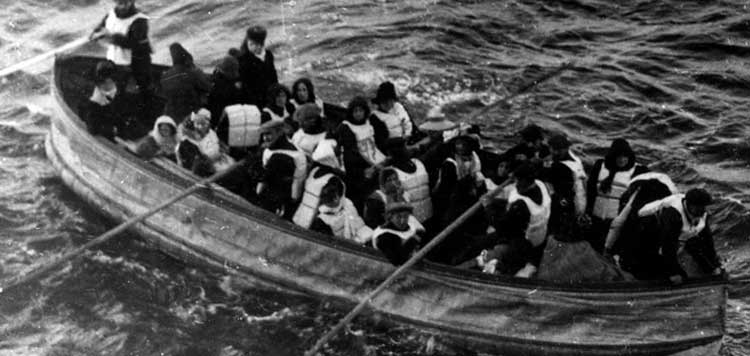
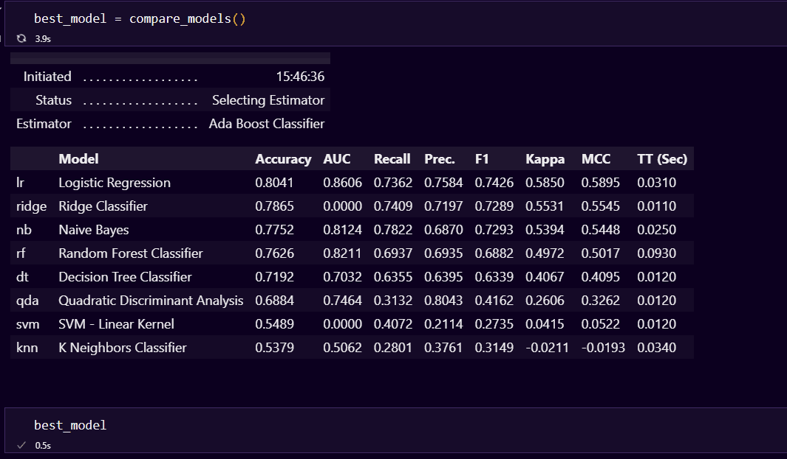
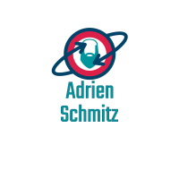

# Project Title

<h2>Kaggle - Titanic</h2>

<!-- Add buttons here -->

Neste projeto, analisarei o conjunto de dados do Naufrágio do Titanic. Uma dos mais famosos desafios, e talvez o primeiro para muita gente, do Kaggle (https://www.kaggle.com/c/titanic), que é uma plataforma de competições de Machine Learning.  Analisarei e enviarei os resultados para a competição real, usando os modelos mais bem posicionados, segundo o modulo pycaret.

# Demo-Preview

  

# Table of contents

- [Project Title](#project-title)
- [Demo-Preview](#demo-preview)
- [Table of contents](#table-of-contents)
- [Installation](#installation)
- [Usage](#usage)
- [License](#license)
- [Footer](#footer)

# Installation
[(Back to top)](#table-of-contents)

- Clone this repository and unzip it
- After downloading, cd into the directory
- Begin a new virtual environment with Python 3.8 and activate it
- Install the required packages using pip install -r requirements.txt
- Use Ctrl+Enter to run the current cell or you can run multiple cells by selecting Run All, Run All Above, or Run All Below

# Usage
[(Back to top)](#table-of-contents)

In https://www.kaggle.com/competitions/titanic/submit, click on the Upload File button, choose smv_titanic.csv and then in Make Submission button. And you will see how your model performed

# License
[(Back to top)](#table-of-contents)

<a href="LICENSE.md">MIT</a>

# Footer
[(Back to top)](#table-of-contents)

 
  

